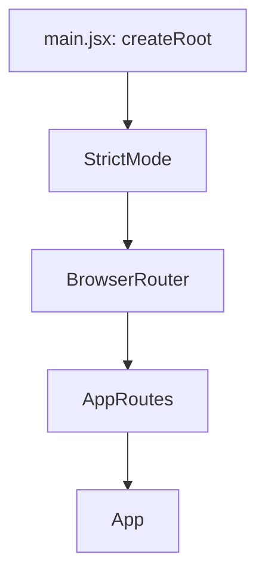
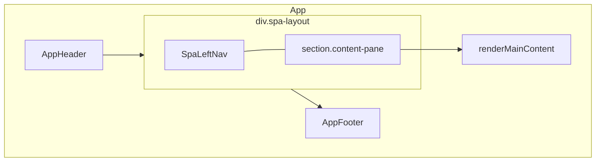
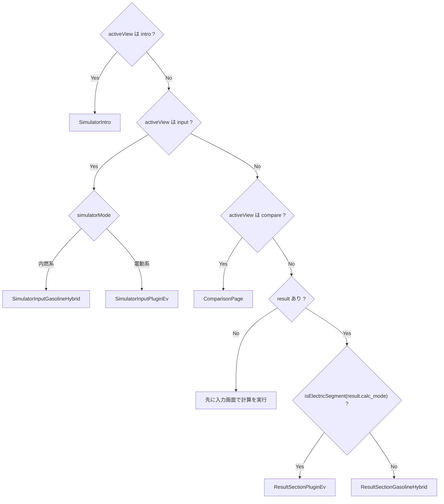
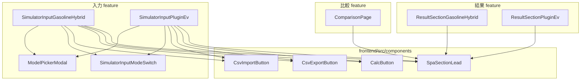

# フロントエンド：コンポーネントの組み立て

このドキュメントは、本リポジトリの React フロントエンド（`frontend`）において、画面がどのコンポーネントから構成され、どの順で表示が切り替わるかを図と短い説明でまとめたものです。対象は `frontend/src` 配下の表示階層と状態の受け渡しの概要に限ります。

---

## 1. アプリケーションのエントリ

`index.html` から読み込まれるエントリは `main.jsx` です。ルーティングは React Router の `BrowserRouter` と、単一路由の `AppRoutes` で包まれています。

- **`main.jsx`**: グローバル CSS・Font Awesome の読み込みのあと、`AppRoutes` をマウントする。
- **`AppRoutes.jsx`**: `path="/*"` で [`App`](../frontend/src/App.jsx) を1つの `<Route>` に渡す。実質シングルページアプリとして動作する。

---

## 2. ルートレイアウト（`App` のシェル）

[`App.jsx`](../frontend/src/App.jsx) は、ヘッダー・左ナビ付き2カラム・フッターを常に描画し、右側のメイン領域だけを `renderMainContent()` の戻り値で差し替える。

- **`AppHeader`**: 現状 `showNav={false}` のため、ヘッダー内のナビゲーションは描画されない（[`AppHeader.jsx`](../frontend/src/features/app/components/layout/AppHeader.jsx)）。
- **`SpaLeftNav`**: 左サイドの「概要 / 入力 / 結果 / 比較」切り替え。項目は `App` 内の `navItems` で定義され、`activeView` と `setActiveView` で制御される。
- **`AppFooter`**: フッター内リンクから `navigateToFooterSection(view, sectionId)` を呼び、ビュー切り替えと該当セクションへのスクロールを行う（後述）。

---

## 3. メイン領域の表示分岐（`renderMainContent`）

状態はカスタムフック [`useCarCostSimulator`](../frontend/src/features/carCostSimulator/hooks/useCarCostSimulator.js) に集約され、`App` はその `state`（例: `activeView`, `simulatorMode`, `result`）とハンドラを子に渡す。

表示の優先順はコード上、次のとおりである（[`App.jsx`](../frontend/src/App.jsx) の `renderMainContent`）。`intro` / `input` / `compare` のいずれでもない場合は **`activeView` の値に関係なく**、まず `result` の有無で分岐する点に注意する。

補足:

- **`activeView === 'input'`** のとき、内燃用か電動用かは `simulatorMode`（`SEGMENT_COMBUSTION` / `SEGMENT_ELECTRIC`）で選ぶ。入力ブロックの下に、API 等の `error` があればアラートが続く。
- **`intro` / `input` / `compare` 以外**（実運用では左ナビの「結果」に相当する `activeView: 'result'` が主）で **`result` がまだない** ときは、案内文のみ表示する。
- **`result` がある** とき、内燃向け・プラグイン向けの結果 UI は `result.calc_mode` を `isElectricSegment` で判定して切り替える（[`segments.js`](../frontend/src/features/carCostSimulator/segments.js)）。

---

## 4. 機能別コンポーネントの依存関係（抜粋）

レイアウト以外の画面は `features/carCostSimulator/components` を中心に置かれ、入力・結果・比較で共通の小さな UI は `frontend/src/components` から import する。

- **入力**: 車種モーダル（`ModelPickerModal`）、モード切替（`SimulatorInputModeSwitch`）、計算ボタン（`CalcButton`）、CSV 入出力（`CsvExportButton` / `CsvImportButton`）などが両入力画面で共有される。
- **結果**: `ResultSectionGasolineHybrid` / `ResultSectionPluginEv` は Chart.js のドーナツ（`react-chartjs-2`）などを内包し、見出しに `SpaSectionLead` を使う。スタイルは `ResultDownloadButton.css` のクラス名を結果・比較のボタンで共有する場合がある。
- **比較**: `ComparisonPage` は比較一覧とダウンロード・クリア操作を担当する。

---

## 5. 左ナビとフッターの役割（状態との対応）

### 左ナビ（`SpaLeftNav`）

`navItems` は [`App.jsx`](../frontend/src/App.jsx) で次のように定義される。

- **概要** (`id: intro`): ランディング相当の `SimulatorIntro`。
- **入力** (`id: input`): 上記の入力コンポーネントのいずれか。
- **結果** (`id: result`): `result` が無いときは `disabled`。計算成功後に結果を表示するビュー。
- **比較** (`id: compare`): ラベルに比較件数が含まれる。`ComparisonPage`。

左ナビの選択は `setActiveView` 経由で `activeView` を更新する。

### フッター（`AppFooter`）

`navigateToFooterSection('intro' | 'input' | 'result', sectionId)` の動きは次の通り（[`useCarCostSimulator.js`](../frontend/src/features/carCostSimulator/hooks/useCarCostSimulator.js)）。

- 既に同じ `activeView` なら、`sectionId` 要素へスムーズスクロールし、URL ハッシュを `#${sectionId}` に合わせる。
- 異なるビューなら、先に `activeView` を更新してから、同様にスクロールとハッシュ更新を行う。

概要画面の CTA（`SimulatorIntro` から `selectSimulatorMode`）は、区分に応じて `simulatorMode` を設定しつつ `activeView` を `'input'` にし、`#simulation-input` へスクロールする処理も同フック内にある。

---

## 参照ファイル一覧（入口）

| 役割 | パス |
|------|------|
| エントリ | [`frontend/src/main.jsx`](../frontend/src/main.jsx) |
| ルート定義 | [`frontend/src/routes/AppRoutes.jsx`](../frontend/src/routes/AppRoutes.jsx) |
| ルートコンポーネント・分岐 | [`frontend/src/App.jsx`](../frontend/src/App.jsx) |
| 状態・操作 | [`frontend/src/features/carCostSimulator/hooks/useCarCostSimulator.js`](../frontend/src/features/carCostSimulator/hooks/useCarCostSimulator.js) |
